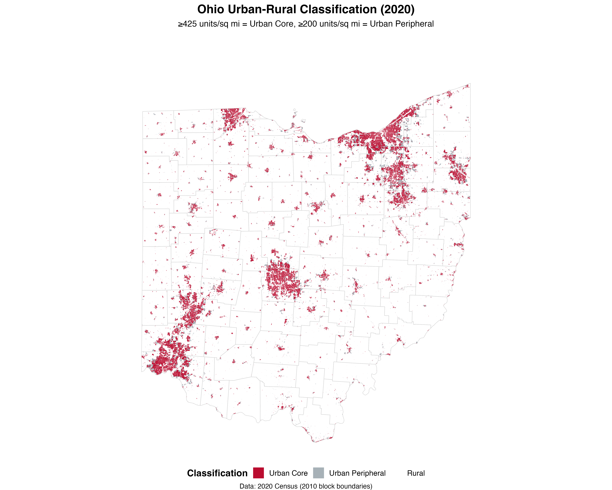
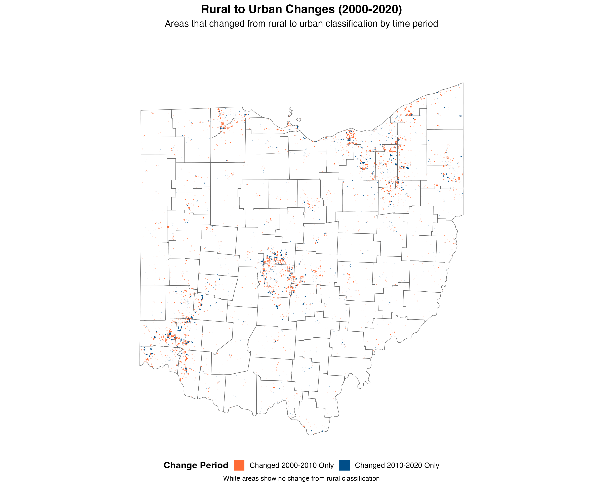

# Ohio Urban Development Analysis (2000-2020)

**Date**: September 5, 2025  
**Newsletter**: Swank Program  
**Analysis**: Rural to Urban Conversion Patterns in Ohio

## Overview

This analysis examines how Ohio's rural areas converted to urban areas from 2000-2020 using Census Bureau housing density criteria and NHGIS crosswalks for consistent geographic boundaries.

## Interactive Maps

### [View Interactive Urban Changes Map](https://gabe-lade.github.io/swank-program-newsletter/20250905-newsletter-repo/figures/map3_urban_conversions.html)

This map shows census blocks that changed from rural to urban classification:
- **Orange**: Changed 2000-2010 
- **Blue**: Changed 2010-2020   

## Static Maps

## Methodology

1. **Data Sources**: 2000, 2010, 2020 Census block-level data
2. **Geographic Consistency**: NHGIS crosswalks interpolate all data to 2010 boundaries
3. **Classification Criteria**:
   - Urban Core: ≥425 housing units per square mile
   - Urban Peripheral: ≥200 housing units per square mile
   - Rural: <200 housing units per square mile

## Files

- `20250905-newsletter.R` - Complete analysis script
- `data/` - NHGIS crosswalk files
- `figures/` - Generated maps and visualizations

## Usage

To reproduce this analysis:
1. Obtain Census API key from [census.gov/developers](https://api.census.gov/data/key_signup.html)
2. Download NHGIS crosswalk files to `data/` folder
3. Run `20250905-newsletter.R`

---

*Part of the [Swank Program Newsletter](https://gabe-lade.github.io/swank-program-newsletter/)*
