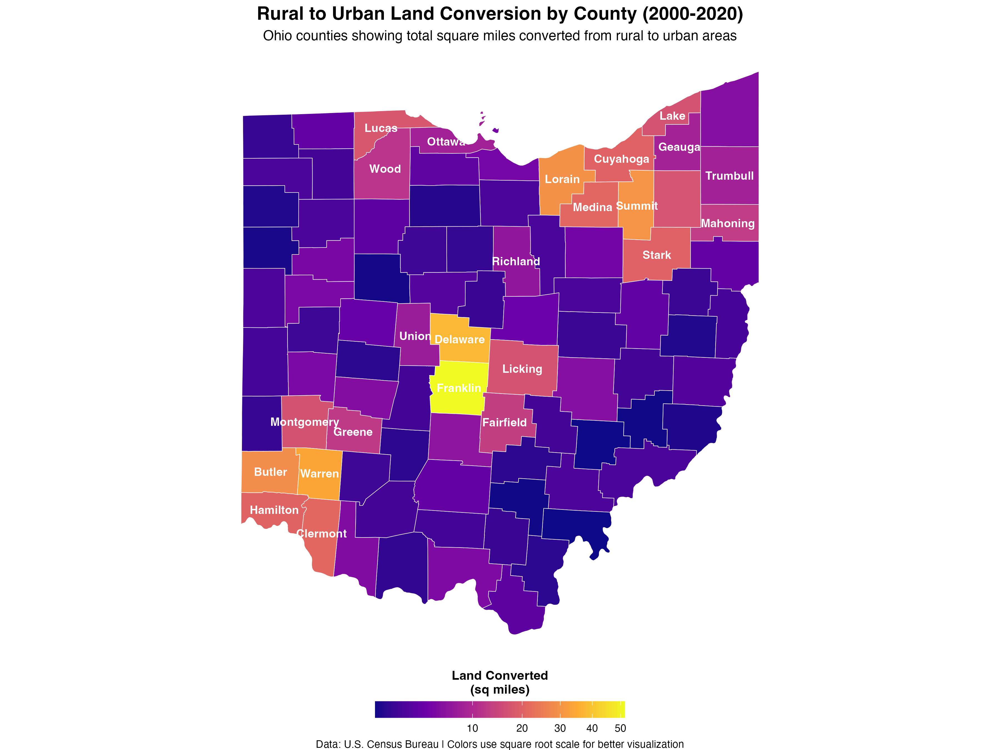

# Ohio Urbanization Analysis (2000-2020)

An analysis of rural-to-urban land conversion in Ohio over two decades (2000-2020), examining changes at the census block and county levels.

## Overview

This project analyzes the transformation of Ohio's landscape from rural to urban areas across two time periods:
- **Period 1**: 2000-2010
- **Period 2**: 2010-2020

The analysis uses census block-level data to identify areas that transitioned from rural to urban classification, providing insights into Ohio's development patterns and urbanization trends.

## Key Findings

The analysis reveals:
- Total number and percentage of census blocks that changed from rural to urban
- Land area (in square miles) converted in each period
- County-level rankings showing which Ohio counties experienced the most rural-to-urban conversion
- Geographic patterns of urbanization across the state

## Visualization

### County-Level Rural-to-Urban Conversion Heat Map (2000-2020)



This heat map shows the total square miles of land converted from rural to urban areas by county. Counties with darker colors experienced more conversion. The map uses a square root scale to better visualize the distribution across counties with varying conversion rates.

## Data Sources

This analysis uses data from:
- **U.S. Census Bureau** - Census block-level urban/rural classifications from the 2000, 2010, and 2020 Decennial Census
- **TIGER/Line Shapefiles** - County boundaries and geographic data

## Prerequisites

### R Packages

Install the required R packages:

```r
install.packages(c(
  "tidyverse",    # Data manipulation and visualization
  "sf",           # Spatial data handling
  "tigris",       # Census geographic data
  "viridis",      # Color palettes
  "ggplot2"       # Plotting
))
```

### Required Data File

This analysis requires a preprocessed data file containing census block-level rural/urban classifications:

**File**: `data/oh_join.rds`

This RDS file should contain an `sf` (simple features) object with the following key columns:
- `blk2010ge` - Census block GEOID (2010)
- `rural_change_2010` - Change status from 2000 to 2010 (e.g., "Rural to Urban", "No Change")
- `rural_change_2020` - Change status from 2010 to 2020
- `geometry` - Spatial geometry for each census block

**Note**: The preprocessing steps to create this file from raw Census data are not included in this repository. The file represents census blocks with their urban/rural classification changes over time.

## File Structure

```
.
├── README.md
├── code/
│   └── 20250918-newsletter.R       # Main analysis script
├── data/
│   └── oh_join.rds                 # Preprocessed census block data
└── figures/
    └── ohio_county_conversion.png  # Output: County heat map
```

## Usage

1. Clone this repository
2. Install required R packages (see Prerequisites)
3. Ensure `data/oh_join.rds` is in place
4. Run the analysis script:

```r
source("code/20250918-newsletter.R")
```

## Output

The script generates:

### 1. Console Output

**Aggregate Statistics**:
- Total census blocks in Ohio
- Number and percentage of blocks that changed from rural to urban in each period
- Total land area conversions in square miles
- Percentages of Ohio's total area converted

**County Rankings**:
- Top 10 counties by total rural-to-urban land conversion (2000-2020)
- Breakdown by time period for each county

### 2. Visualization

**File**: `figures/ohio_county_conversion.png`

A county-level heat map showing:
- Total square miles converted from rural to urban (2000-2020)
- County labels for the top 25 counties by conversion
- Color gradient representing conversion intensity
- Square root scale transformation for better visualization

## Methodology

### Rural vs Urban Classification

The analysis uses the U.S. Census Bureau's urban/rural classification:
- **Urban areas**: Densely developed territory with at least 2,500 people
- **Rural areas**: All other territory not classified as urban

### Change Detection

For each census block, the script identifies:
1. Whether it changed from rural to urban between 2000-2010
2. Whether it changed from rural to urban between 2010-2020
3. Whether it changed in both periods

### Area Calculations

Land area is calculated in square miles using the `sf` package's `st_area()` function, with proper conversion from square meters to square miles (1 square mile = 2,589,988.11 square meters).

### County Aggregation

Block-level changes are aggregated to county level by:
1. Extracting county FIPS codes from block GEOIDs
2. Summing converted land area within each county
3. Joining with county boundary geometries from the `tigris` package

### Visualization Scale

The heat map uses a square root transformation (`trans = "sqrt"`) to handle the wide range of conversion values across counties, making patterns visible for both high and low conversion counties.

## Data Limitations

- The analysis depends on Census Bureau definitions of urban/rural areas, which have evolved over time
- Some census blocks may have boundary changes between decades
- Small areas of conversion may not be visible at the county aggregation level
- The preprocessed data file methodology is not documented here

## Interpretation Notes

- Counties with high conversion rates may indicate:
  - Suburban expansion around major cities
  - Economic development and population growth
  - Infrastructure expansion
  - Changes in land use patterns

- Counties with low conversion rates may indicate:
  - Stable rural character
  - Lower population growth
  - Agricultural or conservation land preservation

## Potential Extensions

This analysis could be extended to:
- Include 2030 Census data (when available)
- Analyze specific types of urban development (residential vs commercial)
- Compare urbanization rates to population growth
- Examine urbanization relative to transportation corridors
- Correlate with economic indicators

## License

This project uses publicly available data from the U.S. Census Bureau. Please cite the Census Bureau when using this analysis:

> U.S. Census Bureau, Decennial Census (2000, 2010, 2020)

## Contact

For questions or issues, please open an issue on this repository.

## Acknowledgments

- U.S. Census Bureau for comprehensive demographic and geographic data
- R community for excellent spatial analysis packages (`sf`, `tigris`)
- `viridis` package creators for colorblind-friendly palettes
