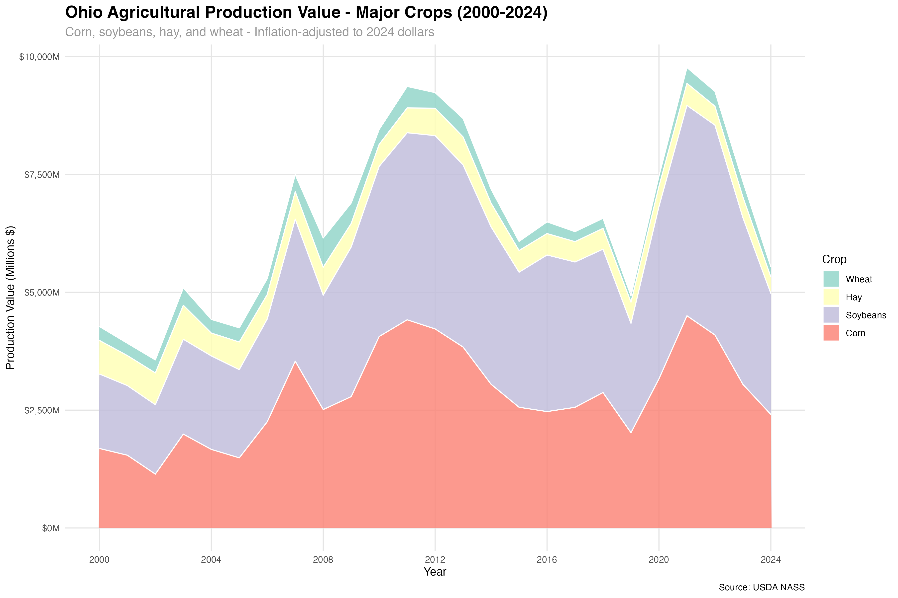
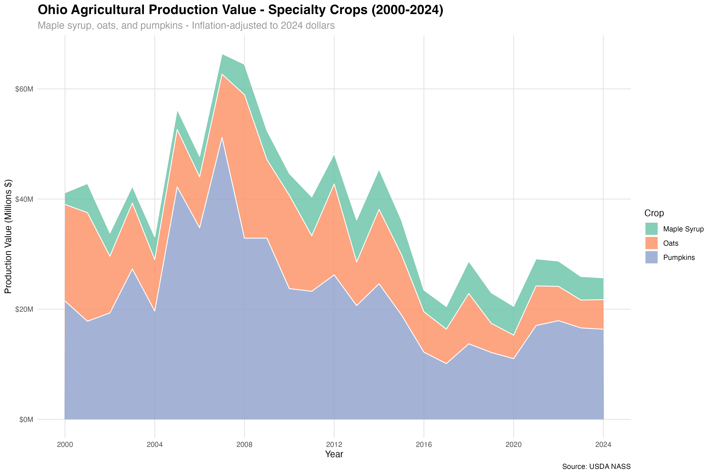
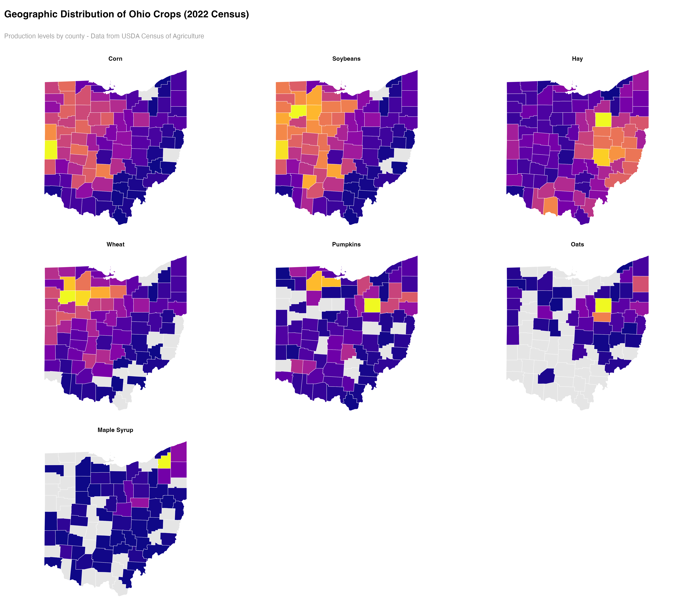

# Ohio Agricultural Crop Production Analysis (2000-2024)

An analysis of Ohio's major agricultural crop commodities from 2000-2024, including production value trends and geographic distribution across counties.

## Overview

This project analyzes the production value of seven major Ohio crops over the past 24 years:
- **Major crops**: Corn, Soybeans, Hay, Wheat
- **Specialty crops**: Pumpkins, Oats, Maple Syrup
Crops were selected based on .

All monetary values are adjusted for inflation to 2024 dollars using the Consumer Price Index (CPI-U) from FRED.

## Visualizations

### Production Value Over Time

#### Major Crops (2000-2024)


The major crops (corn, soybeans, hay, and wheat) dominate Ohio's agricultural production, with combined values reaching several billion dollars annually.

#### Specialty Crops (2000-2024)


Specialty crops like pumpkins, oats, and maple syrup represent smaller but important segments of Ohio agriculture.

### Geographic Distribution (2022 Census)



County-level heat maps show the geographic concentration of each crop across Ohio's 88 counties, based on the 2022 Census of Agriculture.

## Data Sources

This analysis uses data from two primary sources:

1. **USDA National Agricultural Statistics Service (NASS)** - Crop production data
2. **Federal Reserve Economic Data (FRED)** - Consumer Price Index for inflation adjustment

## Prerequisites

### R Packages

Install the required R packages:

```r
install.packages(c(
  "rnassqs",      # USDA NASS API access
  "fredr",        # FRED API access
  "dplyr",        # Data manipulation
  "ggplot2",      # Plotting
  "scales",       # Scale functions for plots
  "purrr",        # Functional programming
  "plotly",       # Interactive plots
  "htmlwidgets",  # HTML widgets
  "sf",           # Spatial data handling
  "tigris",       # Census geographic data
  "viridis",      # Color palettes
  "cowplot"       # Plot arrangements
))
```

### API Keys

This project requires two free API keys:

#### 1. USDA NASS API Key

**Purpose**: Access agricultural statistics data

**How to get it**:
1. Visit the [NASS Quick Stats API page](https://quickstats.nass.usda.gov/api)
2. Click on "Request an API Key"
3. Fill out the registration form with your email address
4. Check your email for the API key
5. The key will be sent immediately to your email address

**Documentation**: [NASS API Documentation](https://quickstats.nass.usda.gov/api)

#### 2. FRED API Key

**Purpose**: Access economic data (CPI for inflation adjustment)

**How to get it**:
1. Visit the [FRED API Key Request page](https://fredaccount.stlouisfed.org/apikeys)
2. Create a free FRED account if you don't have one
3. Log in and go to "API Keys" section
4. Click "Request API Key"
5. Fill out a brief form describing your use
6. Your API key will be generated immediately

**Documentation**: [FRED API Documentation](https://fred.stlouisfed.org/docs/api/fred/)

### Configuration

Create a `config.R` file in your `code/` directory with your API keys:

```r
# API Configuration File
# DO NOT commit this file to version control

# NASS API Key
# Get your key from: https://quickstats.nass.usda.gov/api
NASS_API_KEY <- "YOUR_NASS_API_KEY_HERE"

# FRED API Key
# Get your key from: https://fred.stlouisfed.org/docs/api/api_key.html
FRED_API_KEY <- "YOUR_FRED_API_KEY_HERE"
```

**Important**: Add `config.R` to your `.gitignore` file to keep your API keys private:

```
# .gitignore
code/config.R
```

## File Structure

```
.
├── README.md
├── code/
│   ├── config.R                    # API keys (not tracked in git)
│   └── 20251003-newsletter.R       # Main analysis script
├── ohio_major_crops.png            # Output: Major crops time series
├── ohio_specialty_crops.png        # Output: Specialty crops time series
└── ohio_crops_county_map.png       # Output: County-level distribution maps
```

## Usage

1. Clone this repository
2. Install required R packages (see Prerequisites)
3. Obtain API keys from USDA NASS and FRED
4. Create `code/config.R` with your API keys
5. Run the main script:

```r
source("code/20251003-newsletter.R")
```

## Output

The script generates:

1. **Console output**: Summary statistics table showing average values, total values, and individual year values (2022-2024) for each crop
2. **Three PNG files**:
   - `ohio_major_crops.png` - Time series of major crop production values
   - `ohio_specialty_crops.png` - Time series of specialty crop production values
   - `ohio_crops_county_map.png` - Grid of county-level heat maps for all crops

## Methodology

### Inflation Adjustment
All dollar values are adjusted to 2024 dollars using the Consumer Price Index for All Urban Consumers (CPI-U) from FRED. The adjustment formula is:

```
Real Value (2024$) = Nominal Value × (CPI_2024 / CPI_year)
```

### Geographic Data
County-level production data comes from the 2022 Census of Agriculture. Counties with suppressed data (due to privacy rules) or no production appear in grey on the maps.

### Data Limitations
- Some county-level data is suppressed by USDA to protect farmer privacy
- 2024 data may be preliminary and subject to revision
- Different crops use different production units (bushels, tons, gallons, acres)

## License

This project uses publicly available data from USDA NASS and FRED. Please cite these sources when using this analysis:

- USDA National Agricultural Statistics Service, Quick Stats Database
- Federal Reserve Bank of St. Louis, FRED Economic Data

## Contact

For questions or issues, please open an issue on this repository.

## Acknowledgments

- USDA National Agricultural Statistics Service for comprehensive agricultural data
- Federal Reserve Economic Data (FRED) for economic indicators
- R community for excellent data analysis packages
